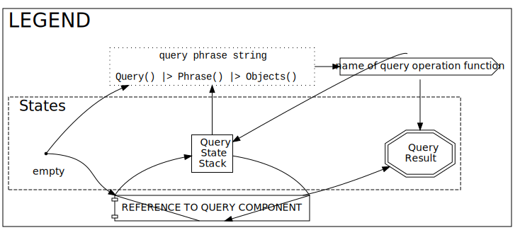

# Queries

```@docs
DataAxesFormats.Queries
```

## Construction

```@docs
DataAxesFormats.Queries.Query
DataAxesFormats.Queries.QuerySequence
DataAxesFormats.Queries.QueryString
DataAxesFormats.Queries.parse_query
DataAxesFormats.Queries.@q_str
```

## Syntax

Each description of a part of the query syntax is accompanied by a diagram.

[**Legend**](assets/legend.svg)



```@docs
DataAxesFormats.Queries.NAMES_QUERY
DataAxesFormats.Queries.SCALAR_QUERY
DataAxesFormats.Queries.VECTOR_QUERY
DataAxesFormats.Queries.VECTOR_OPERATION
DataAxesFormats.Queries.VECTOR_AS_AXIS
DataAxesFormats.Queries.VECTOR_LOOKUP
DataAxesFormats.Queries.VECTOR_MASK
DataAxesFormats.Queries.VECTOR_MASK_LOOKUP
DataAxesFormats.Queries.VECTOR_MASK_OPERATION
DataAxesFormats.Queries.VECTOR_GROUP
DataAxesFormats.Queries.VECTOR_FROM_MATRIX
DataAxesFormats.Queries.MATRIX_QUERY
DataAxesFormats.Queries.MATRIX_COUNT
DataAxesFormats.Queries.MATRIX_OPERATION
DataAxesFormats.Queries.MATRIX_GROUP
```

## Functions

```@docs
DataAxesFormats.Queries.get_query
DataAxesFormats.Queries.has_query
DataAxesFormats.Queries.get_frame
DataAxesFormats.Queries.FrameColumn
DataAxesFormats.Queries.FrameColumns
DataAxesFormats.Queries.full_vector_query
DataAxesFormats.Queries.query_result_dimensions
DataAxesFormats.Queries.query_requires_relayout
DataAxesFormats.Queries.is_axis_query
DataAxesFormats.Queries.query_axis_name
DataAxesFormats.Queries.guess_typed_value
```

## Query Operators

### Names

```@docs
DataAxesFormats.Queries.Names
```

### Lookup

```@docs
DataAxesFormats.Queries.LookupScalar
DataAxesFormats.Queries.Axis
DataAxesFormats.Queries.AsAxis
DataAxesFormats.Queries.LookupVector
DataAxesFormats.Queries.LookupMatrix
DataAxesFormats.Queries.SquareColumnIs
DataAxesFormats.Queries.SquareRowIs
DataAxesFormats.Queries.IfMissing
DataAxesFormats.Queries.IfNot
```

### Masks

```@docs
DataAxesFormats.Queries.BeginMask
DataAxesFormats.Queries.BeginNegatedMask
DataAxesFormats.Queries.EndMask
DataAxesFormats.Queries.AndMask
DataAxesFormats.Queries.AndNegatedMask
DataAxesFormats.Queries.OrMask
DataAxesFormats.Queries.OrNegatedMask
DataAxesFormats.Queries.XorMask
DataAxesFormats.Queries.XorNegatedMask
```

### Comparisons

```@docs
DataAxesFormats.Queries.IsLess
DataAxesFormats.Queries.IsLessEqual
DataAxesFormats.Queries.IsEqual
DataAxesFormats.Queries.IsNotEqual
DataAxesFormats.Queries.IsGreater
DataAxesFormats.Queries.IsGreaterEqual
DataAxesFormats.Queries.IsMatch
DataAxesFormats.Queries.IsNotMatch
```

### Groups

```@docs
DataAxesFormats.Queries.CountBy
DataAxesFormats.Queries.GroupBy
DataAxesFormats.Queries.GroupColumnsBy
DataAxesFormats.Queries.GroupRowsBy
DataAxesFormats.Queries.ReduceToColumn
DataAxesFormats.Queries.ReduceToRow
```

## Index

```@index
Pages = ["queries.md"]
```
